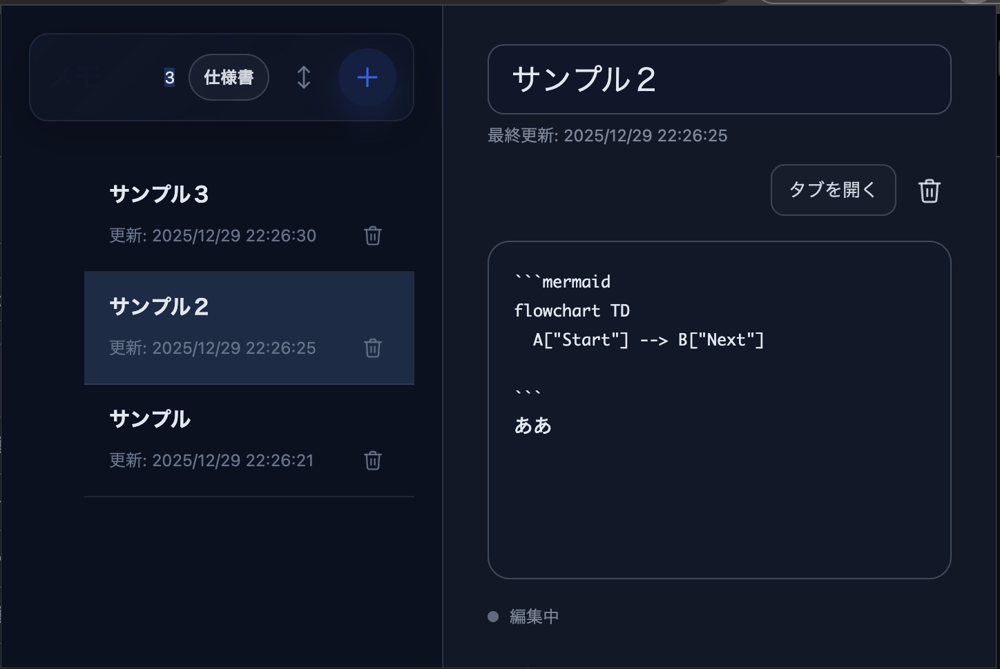

# Mermaid Markdown Memo

Markdown と Mermaid に対応した Chrome 拡張のメモアプリです。
ポップアップでもタブでも使えて、データは全てローカルに保存されます。

  

## 特徴

- **Markdown エディタ** — 見出し・リスト・チェックボックス・コードブロック等をサポート
- **Mermaid 図** — フローチャートやシーケンス図をプレビュー描画
- **ポップアップ & タブ** — ツールバーアイコンからサッと開いても、タブでじっくり編集しても OK
- **5 テーマ + カスタム** — Light / Dark / Solarized Light / Nord / Dracula、さらに自分好みの配色も作れる
- **完全ローカル** — 外部通信なし。データは `chrome.storage.local` のみ

## インストール

1. このリポジトリをクローンまたはダウンロード
2. Chrome で `chrome://extensions` を開く
3. 右上の **デベロッパーモード** を ON にする
4. **「パッケージ化されていない拡張機能を読み込む」** → `extension/` フォルダを選択

## 使い方

| 場所 | できること |
|------|-----------|
| 左サイドバー | メモの一覧・追加・削除・並び替え（ドラッグ & ドロップ対応） |
| 右エディタ | タイトルと本文の編集、プレビュー切替 |
| タブ表示 | 左右分割のエディタ + リアルタイムプレビュー、Markdown ツールバー |
| テーマ設定 | プリセット選択またはカスタムカラーの作成 |

## 技術構成

- Manifest V3 / プレーン JS・CSS・HTML（ビルド不要）
- Mermaid.js 同梱（セキュアモード）
- CSP を厳格に設定済み（XSS 対策・DOM サニタイズ実装）

## ライセンス

[MIT](./LICENSE)
