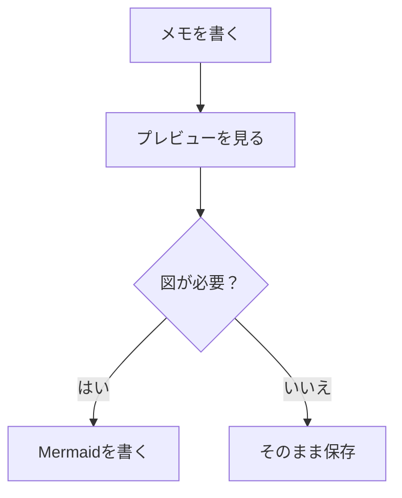
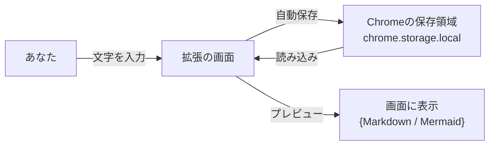

# Mermaid Markdown Memo 仕様書（やさしい解説）

更新日時: 2025-12-29 (JST)

## このアプリは何？

Mermaid Markdown Memo は、Markdown（マークダウン）でメモを書き、必要に応じて Mermaid（図を描くための記法）をプレビューできるメモアプリです。

- **メモを書く**: 普通の文章を書けます
- **Markdownを使う**: 見出し、箇条書き、コードなどが書けます
- **Mermaidを使う**: フローチャートなどの図が書けます
- **タブで切り替え**: 「編集」と「プレビュー」を切り替えて確認できます

## 画面の説明

### 左側（メモ一覧）

- **メモ一覧**: いまあるメモが並びます。クリックすると切り替わります。
- **件数表示**: メモの数が表示されます。
- **仕様書ボタン**: この説明書を開きます。
- **並び替えボタン**: 更新日時の順番を入れ替えます。
- **＋ボタン**: 新しいメモを作ります。

### 右側（メモの中身）

- **タイトル**: メモの名前です。
- **本文**: Markdownで書く場所です。
- **タブを開く**: 大きい画面（タブ）で、編集やプレビューをしやすくします。
- **ゴミ箱**: メモを削除します。

## 使い方（基本）

1. **＋** を押して新しいメモを作る
2. タイトルと本文を入力する
3. 大きい画面で見たいときは **タブを開く** を押す
4. タブ側で **編集 / プレビュー** を切り替えて確認する

### タブ専用のMarkdown挿入ツールバー
- 編集エリアの上にあります（タブ画面のみ）。
- ボタン: H1 / H2 / 箇条書き / 番号 / チェック / コード / Mermaidテンプレ
- 複数行選択時は各行にプレフィックスを付与、Mermaidは雛形を挿入します。

## Markdownの例

### 箇条書き

```md
- りんご
- みかん
- ぶどう
```

入力中、行末で Enter を押すと次の行に `- ` が自動で入るようにしています（書きやすくするため）。

### チェックリスト

```md
- [ ] やることA
- [x] 済んだことB
```

- Enter で次の行にも `- [ ] ` が自動挿入されます（プレフィックスだけの行なら終了）。
- プレビューではチェックボックスとして表示されます（クリックは無効化）。

### 見出し

```md
# 大見出し
## 中見出し
### 小見出し
```

## Mermaidの例（図のプレビュー）

本文に次のように書きます。

```md

```

プレビューで、次のような図になります。


## よくある質問

### Q. データはどこに保存されますか？
Chrome のローカル保存領域（拡張の保存場所）に保存されます。

### Q. インターネットに送信されますか？
このアプリは外部サーバーに送信する仕組みを持ちません。

### Q. Mermaidが表示されない
- Mermaid のファイル（`extension/src/lib/mermaid.min.js`）が配置されているか確認してください。

## 安全性とデータ保存（大事）

更新日時: 2025-12-29 (JST)

この節は、以下を根拠にまとめています。

- 実装: `extension/manifest.json`（permissions） / `extension/src/storage.js`（保存キー）
- 公式（鮮度高）: Chrome Developers `chrome.storage`（Localの説明）
- 公式（鮮度高）: Chrome DevTools `Extension Storage`（保存内容の確認方法）
- 公式（鮮度低）: Chrome Extensions `Protect user privacy`（考え方として参照。ページ最終更新が古い点に注意）

### この拡張が持っている権限

- 権限は **storage のみ**（メモを保存するため）
- サイトアクセス（host_permissions）を要求しない

### データはどこに保存される？

メモは Chrome 拡張の保存領域 **`chrome.storage.local`** に保存されます。
（公式説明: local はPC内に保存され、拡張を削除すると消える）

### 保存しているデータの中身（保存キー）

この拡張は次のキー名で保存します（`storage.js` を根拠）。

- `notes`：メモ本体（タイトル/本文/更新日時など）
- `noteSortOrder`：左の一覧の並び順
- `sortDirection`：並び替えの昇順/降順

### データの流れ（Mermaid図）



### ネット送信はある？

- この拡張は **外部サーバーへ送る処理を持っていません**（通信を前提にしていません）。
- 保存先は **あなたのChrome内** です。

### 注意点（より正直な説明）

- **拡張の保存領域は暗号化された保管庫ではありません**。
  公式のプライバシーガイドでも、機密データを拡張ストレージに保持しない注意喚起があります。
  ただし、該当ページは最終更新が古いので、考え方として参照しています。
- この拡張は「パスワード」や「秘密鍵」などの保管用途には向きません。

### 自分のデータを確認/削除する方法

- **確認**: DevTools の Application > Storage > Extension Storage から確認できます。
- **削除**: Chrome の「拡張機能を管理」画面からこの拡張を削除すると、localのデータも消えます。
