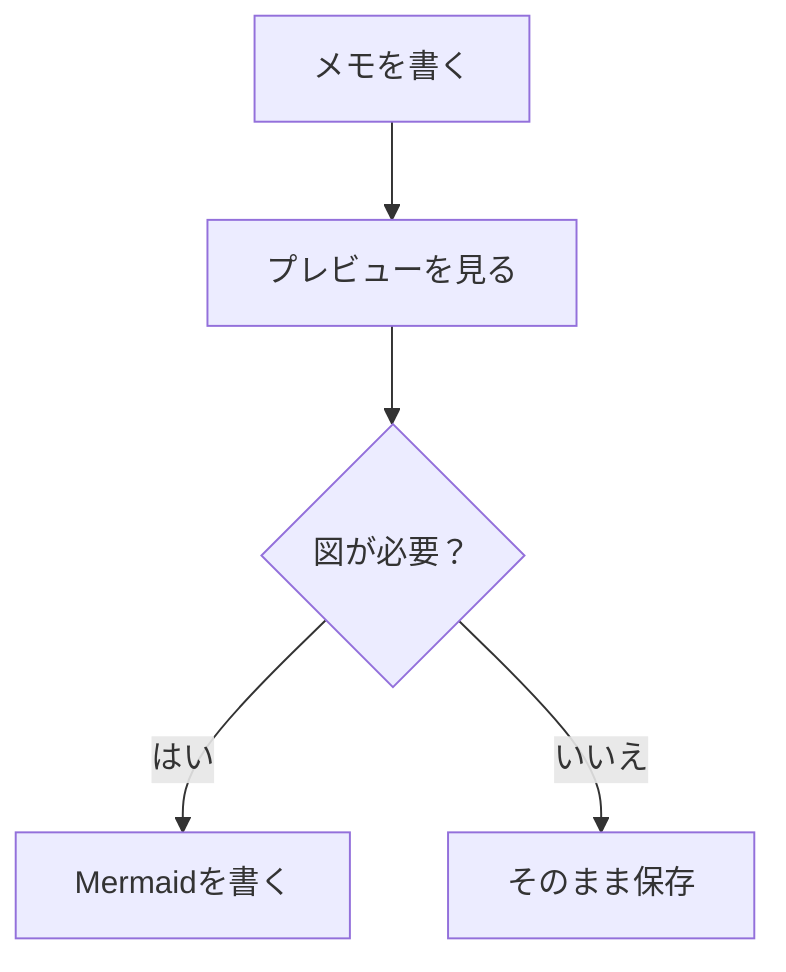

# Mermaid Markdown Memo 仕様書（やさしい解説）

更新日時: 2025-12-29 (JST)

## このアプリは何？

Mermaid Markdown Memo は、Markdown（マークダウン）でメモを書き、必要に応じて Mermaid（図を描くための記法）をプレビューできるメモアプリです。

- **メモを書く**: 普通の文章を書けます
- **Markdownを使う**: 見出し、箇条書き、コードなどが書けます
- **Mermaidを使う**: フローチャートなどの図が書けます
- **タブで切り替え**: 「編集」と「プレビュー」を切り替えて確認できます

## 画面の説明

### 左側（メモ一覧）

- **メモ一覧**: いまあるメモが並びます。クリックすると切り替わります。
- **件数表示**: メモの数が表示されます。
- **仕様書ボタン**: この説明書を開きます。
- **並び替えボタン**: 更新日時の順番を入れ替えます。
- **＋ボタン**: 新しいメモを作ります。

### 右側（メモの中身）

- **タイトル**: メモの名前です。
- **本文**: Markdownで書く場所です。
- **タブを開く**: 大きい画面（タブ）で、編集やプレビューをしやすくします。
- **ゴミ箱**: メモを削除します。

## 使い方（基本）

1. **＋** を押して新しいメモを作る
2. タイトルと本文を入力する
3. 大きい画面で見たいときは **タブを開く** を押す
4. タブ側で **編集 / プレビュー** を切り替えて確認する

## Markdownの例

### 箇条書き

```md
- りんご
- みかん
- ぶどう
```

入力中、行末で Enter を押すと次の行に `- ` が自動で入るようにしています（書きやすくするため）。

### 見出し

```md
# 大見出し
## 中見出し
### 小見出し
```

## Mermaidの例（図のプレビュー）

本文に次のように書きます。

```md

```

プレビューで、次のような図になります。


## よくある質問

### Q. データはどこに保存されますか？
Chrome のローカル保存領域（拡張の保存場所）に保存されます。

### Q. インターネットに送信されますか？
このアプリは外部サーバーに送信する仕組みを持ちません。

### Q. Mermaidが表示されない
- Mermaid のファイル（`extension/src/lib/mermaid.min.js`）が配置されているか確認してください。

## 安全面（かんたん）

- 権限は **storage のみ** を使います。
- Mermaid は安全設定（`securityLevel: strict`）で動くようにしています。
